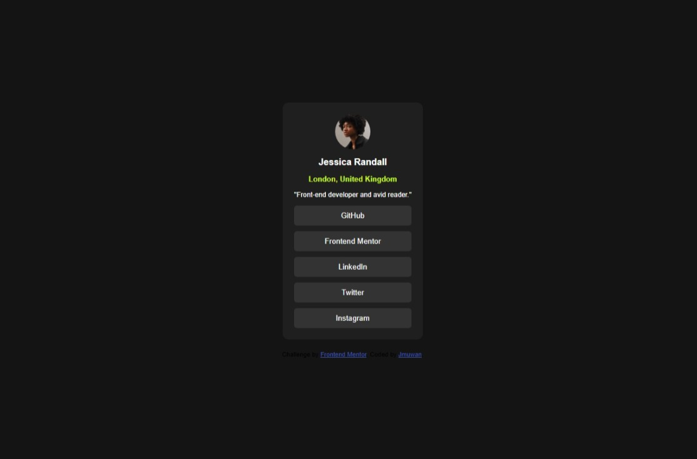

# Frontend Mentor - Social links profile solution

This is a solution to the [Social links profile challenge on Frontend Mentor](https://www.frontendmentor.io/challenges/social-links-profile-UG32l9m6dQ). Frontend Mentor challenges help you improve your coding skills by building realistic projects. 

## Table of contents

- [Overview](#overview)
  - [The challenge](#the-challenge)
  - [Screenshot](#screenshot)
  - [Links](#links)
- [My process](#my-process)
  - [Built with](#built-with)
  - [What I learned](#what-i-learned)
  - [Continued development](#continued-development)
- [Author](#author)


## Overview

### The challenge
In this small project, i had to build out a social link-sharing profile.


### Screenshot



### Links

- Solution URL: (https://github.com/jmuwan/Social-Links-Profile)
- Live Site URL: (https://jmuwan.github.io/Social-Links-Profile/)

## My process
-Download the starter code and go through the README.md file.
-Build the index.html file and organise it 
-Create CSS to style the index.html, then use link element to link my external CSS
-Use CSS to style the index.html 
### Built with

- Semantic HTML5 markup
- CSS custom properties
- Flexbox

### What I learned
-Using flex-box direction column method

```css
.container{
  display: flex;
  flex-direction: column;
}
```

### Continued development

-Customisation

## Author

- Website - [Muwanguzi Joshua](https://github.com/jmuwan)
- Frontend Mentor - [@jmuwan](https://www.frontendmentor.io/profile/jmuwan)
- Twitter - [@muwanguzijosh25](https://www.x.com/muwanguzijosh25)